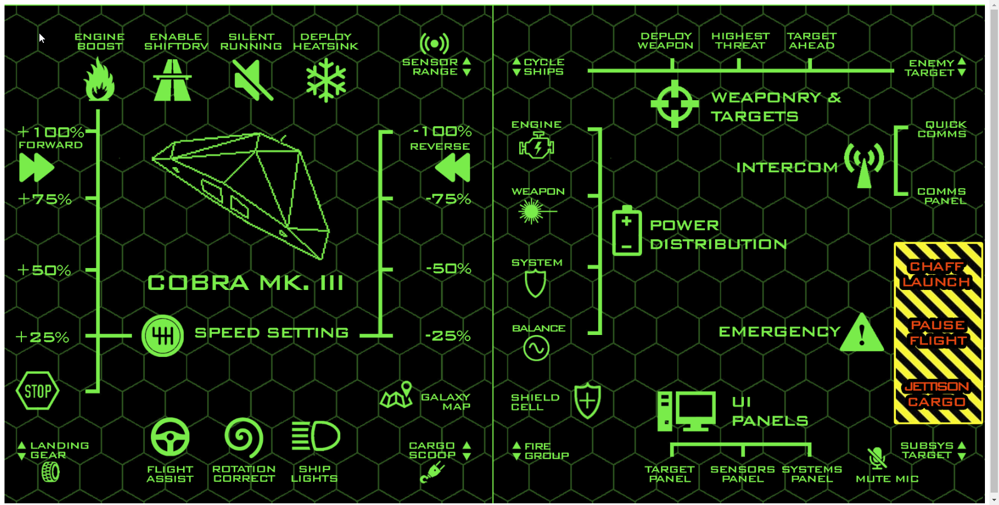

# Elite Dangerous Virtual Button Box

# What

Consist on a UI that is loaded via a web browser on a Phone or Tablet and a windows application will listen in a port for API calls from the UI.

The `/event` call will send the key and a modifier to the application that currently has focus.

The `/status` call will read the `status.json` file that the game writes and parse it, thanks to BenJuan26 go module for ED.

# Why

To be able to create a Virtual button box for use in Elite Dangerous

# How
* Download here: https://github.com/bruj0/EDVBB/archive/v1.0.zip
* Run EDVBB.exe in a cmd window with administrator priviliges, this is needed because of the keypress simulation (or build your own from the go files).

* Load the UI on your tablet or phone at: http://<you ip>:8080/html/ 




To change the configuration edit `index.html`

```json
        var keymaps = {
            "engine_boost": { mod: "SHIFT", key: "A"},
            "enable_shiftdrv": { key: "B" },
            "silent_running": { key: "C"},
            "deploy_heatsink": { key: "D"},
            "sensor_rangeUP": { key: "E"},
            "speed_100": { key: "F"},
            "speed_75": { key: "G"},
            "speed_50": { key: "I"},
            "speed_25": { key: "J"},
            "speed_r100": { key: "F1"},
            "speed_r75": { key: "F2"},
            "speed_r50": { key: "F3"},
            "speed_r25": { key: "HOME"},            
            "forward": { key: "H"},
            "stop": { key: "K"},
            "landing_gear": { key: "M"},
            "flight_assist": { key: "N"},
            "rotation_correct": { key: "O"},
            "ship_lights": { key: "P"},
            "cargo_scoop": { key: "Q"},
            "galaxy_map": { key: "R"},
            "cycle_shipsUP": { key: "S"},
            "reverse": { key: "T"},
            "engine": { key: "U"},
            "weapon": { key: "V"},
            "system": { key: "W"},
            "balance": { key: "X"},
            "shield_cell": { key: "Y"},
            "fire_groupUP":{ key: "Z"},
            "deploy_weapon":{ key: "NUMPAD0"},
            "highest_threat":{ key: "NUMPAD1"},
            "target_ahead":{ key: "NUMPAD2"},
            "enemy_targetUP":{ key: "NUMPAD3"},
            "quick_comms":{ key: "NUMPAD4"},
            "comm_panels":{ key: "NUMPAD5"},
            "chaff_launch":{ key: "NUMPAD6"},
            "pause_flight":{ key: "NUMPAD7"},
            "jettison_cargo":{ key: "NUMPAD8"},
            "subsys_targetUP":{ key: "NUMPAD9"},
            "mute_mic":{ key: "F5"},
            "system_panel":{ key: "F6"},
            "sensor_panel":{ key: "F7"},
            "target_panel":{ key: "F8"},
            "sensor_rangeDOWN":{ key: "F9"},
            "cycle_shipsDOWN":{ key: "F10"},
            "enemy_targetDOWN":{ key: "F11"},
            "fire_groupDOWN":{ key: "F12"},
            "subsy_targetDOWN":{ key: "F4"},

        }
```        

# Credits:

* Thanks to NC Sarge for the inserts to create the UI: https://forums.frontier.co.uk/threads/ed-panel-inserts-for-thrustmaster-cougar-pack-mfds.52342/
* Thanks to BenJuan26 for his ED journal parser: https://github.com/BenJuan26/elite
